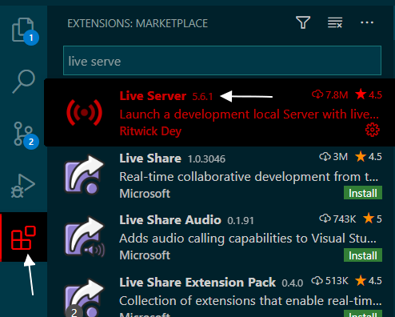
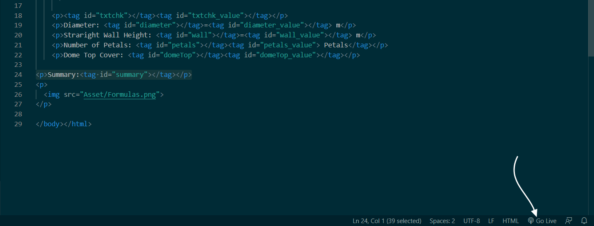

# Dome App

[](https://github.com/RichardLitt/standard-readme)


## Table of Contents

- [Background](#background)
- [Install](#install)
- [Usage](#usage)
- [Resources](#Resources)
- [License](#license)

## Background
This project is aimed to be a one-stop-shop that helps Geodesic Domes enthusiast to get started. The appliation helps you with getting your dome dimensions right and will guide in the prcoess of installation and finally producing cover schematics.


## Install
 
 I highly recommend using VSCode to run this application and debug. VSCode will provide all the functionalities need for debugging as well as running the Application as HTTP Server
1. Clone this repo to your machine.

```sh
$ git clone https://github.com/Ozeidi/Dome.git
```
2. Open the clonned repo in VSCode and Install ` Liver Server ` from the extensions:


3. Click on the ` Go Live ` button at the status bar. The app should open up in a new browser window/tab. 



## Usage
More details to come

##  Resources
More Details to come

## License

[MIT](LICENSE) © Omar Al Zeidi